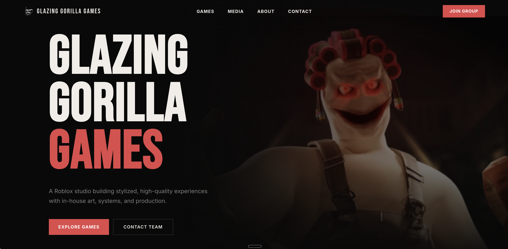
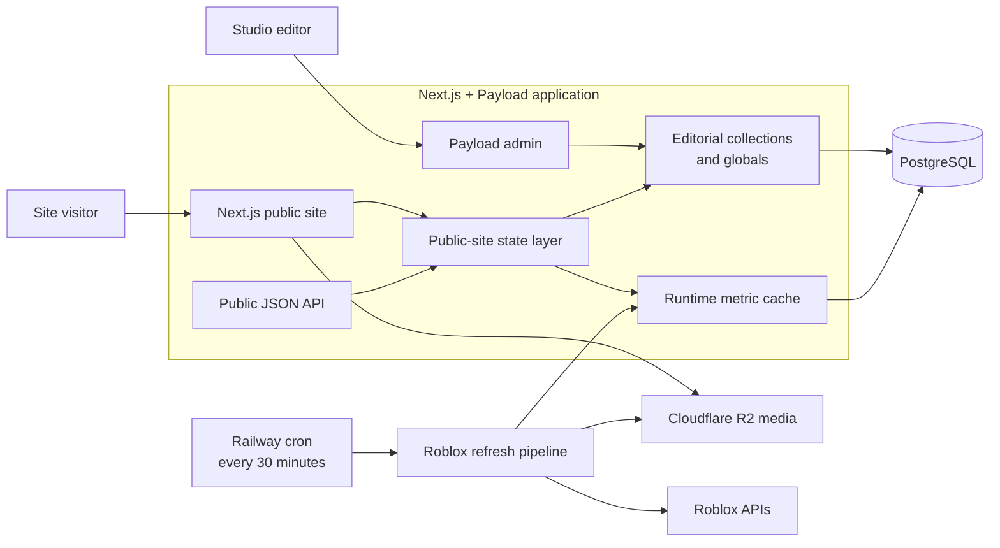

<p align="center">
  
</p>

<h1 align="center">Glazing Gorilla Games</h1>

<p align="center">
  <strong>A studio site backed by live Roblox data.</strong><br />
  Editorial control through Payload CMS, runtime metrics from Roblox, and media served from Cloudflare R2.
</p>

<p align="center">
  <a href="https://glazinggorillas.com">Live site</a>
</p>

The Glazing Gorilla Games website presents the studio, its catalog, community reach,
and media work in one fast, content-managed experience. The public pages are built
with Next.js and React; Payload CMS owns the editorial catalog and site copy; a
scheduled worker keeps game, group, and thumbnail data synchronized with Roblox.

The important boundary is between editorial intent and external runtime data. The
CMS decides which games and groups appear, how they are ordered, and what the site
says. Roblox supplies names, visits, active players, member counts, votes, and
thumbnails. The server combines both into a stable public-site contract so the UI
does not depend directly on third-party APIs.

## Architecture



The browser reads server-rendered data assembled inside the application. It does
not call Roblox directly. That keeps external rate limits and partial failures away
from the request path, while still allowing frequently updated stats to appear
alongside CMS-managed content.

### Runtime refresh

1. The worker loads the active game and group IDs from Payload.
2. Game details, votes, icons, and group details are fetched from Roblox in parallel.
3. Retryable `429` and `5xx` responses use bounded exponential backoff; individual
   failures are retained as warnings instead of discarding the entire refresh.
4. Successful results are upserted into dedicated runtime collections. Lifetime
   visits are guarded against regressions caused by transient empty API responses.
5. Roblox thumbnails are copied to R2 and reused for seven days, reducing dependence
   on temporary upstream image URLs.
6. Each run records its status, totals, warnings, timestamps, and source snapshots
   for inspection in the Payload admin panel.

Creating a game or group in the CMS also triggers a focused refresh for that record,
so editors do not need to wait for the next scheduled run to see its Roblox metadata.

## Content and data model

| Concern          | Source of truth     | Examples                                                 |
| ---------------- | ------------------- | -------------------------------------------------------- |
| Studio content   | Payload globals     | navigation, hero, proof bar, about, contact, footer      |
| Catalog curation | Payload collections | active games and groups, display order                   |
| Media and social | Payload + R2        | key art, videos, media cards, social profiles            |
| Roblox state     | Runtime collections | active players, visits, votes, group members, thumbnails |
| Refresh history  | Runtime collection  | success state, warnings, totals, raw snapshots           |

The state layer joins these records by Roblox universe or group ID and exposes a
versioned `public-site-v1` contract. It includes source and freshness metadata, has
a short in-process cache with request coalescing, and falls back to editorial-only
rendering when no runtime snapshot is available. A read-only JSON representation is
also available at `/api/public/site-data`.

Payload access rules keep public content readable while restricting writes and
runtime collections to authenticated administrators. Trusted refresh jobs use the
Payload Local API explicitly as system operations.

## Tech stack

| Layer          | Technology                                                |
| -------------- | --------------------------------------------------------- |
| Web            | Next.js 16, React 19, JavaScript/TypeScript, Tailwind CSS |
| CMS and API    | Payload CMS 3, REST, GraphQL, Lexical                     |
| Database       | PostgreSQL via Payload's Postgres adapter                 |
| Object storage | Cloudflare R2 through the S3-compatible adapter           |
| Live data      | Roblox game, vote, thumbnail, and group APIs              |
| Analytics      | PostHog, Vercel Analytics, and Vercel Speed Insights      |
| Infrastructure | Railway web service and scheduled refresh service         |
| Quality        | Vitest, Playwright, ESLint, generated Payload types       |

## Project map

```text
src/app/(public)/              public routes and server-rendered entry points
src/app/(payload)/             Payload admin, REST, and GraphQL routes
src/app/api/public/            versioned public-site JSON endpoint
src/features/publicSite/       pages, sections, UI, and presentation transforms
src/collections/               editorial and runtime Payload collections
src/globals/                   site-wide Payload content
src/lib/publicSite/            CMS/runtime composition and short-lived state cache
src/lib/runtime/               Roblox client, refresh pipeline, and R2 thumbnail cache
src/scripts/                   refresh and seed commands
tests/int/                     runtime, API, and cache integration tests
tests/e2e/                     Payload admin browser tests
railway.json                   web-service deployment configuration
railway.cron.json              scheduled refresh-service configuration
```

## Run locally

Requirements: Node.js 22+, pnpm 9 or 10, and a PostgreSQL database.

```bash
pnpm install
cp .env.example .env
pnpm dev
```

Set at least `PAYLOAD_SECRET`, `DATABASE_URL`, and `NEXT_PUBLIC_SITE_URL` in `.env`,
then open `http://localhost:3000`. The Payload admin panel is available at `/admin`.

R2 is optional during local development. Without its five storage variables, the
R2 adapter is disabled and Roblox thumbnail mirroring is skipped; the rest of the
application can still run against PostgreSQL. PostHog uses the project token from
the environment when analytics are configured.

| Variable                            | Purpose                             |
| ----------------------------------- | ----------------------------------- |
| `PAYLOAD_SECRET`                    | signs Payload authentication tokens |
| `DATABASE_URL`                      | PostgreSQL connection string        |
| `NEXT_PUBLIC_SITE_URL`              | canonical application URL           |
| `ALLOWED_ORIGINS`                   | extra admin origins for Payload CSRF (comma-separated) |
| `NEXT_PUBLIC_POSTHOG_PROJECT_TOKEN` | optional PostHog project token      |
| `R2_BUCKET`                         | R2 bucket name                      |
| `R2_PUBLIC_URL`                     | public base URL for stored media    |
| `S3_ACCESS_KEY_ID`                  | R2 S3-compatible access key         |
| `S3_SECRET_ACCESS_KEY`              | R2 S3-compatible secret             |
| `S3_ENDPOINT`                       | account-specific R2 endpoint        |

## Useful commands

```bash
pnpm dev                    # start Next.js and Payload in development
pnpm build                  # create a production build
pnpm runtime:refresh        # run one Roblox refresh
pnpm runtime:refresh:watch  # refresh immediately, then every five minutes
pnpm generate:types         # regenerate Payload TypeScript definitions
pnpm lint                   # run ESLint
pnpm test:int               # run Vitest integration tests
pnpm test:e2e               # run Playwright admin tests
pnpm test                   # run both test suites
```

## Deployment

The repository contains two Railway service definitions:

- `railway.json` builds and starts the Next.js/Payload web service, with
  `/api/health` used as the deployment health check.
- `railway.cron.json` runs `pnpm runtime:refresh` every 30 minutes as a separate,
  non-restarting scheduled service.

Both services share PostgreSQL and the same application configuration. R2 stores
editorial uploads and cached Roblox thumbnails outside the application filesystem.
